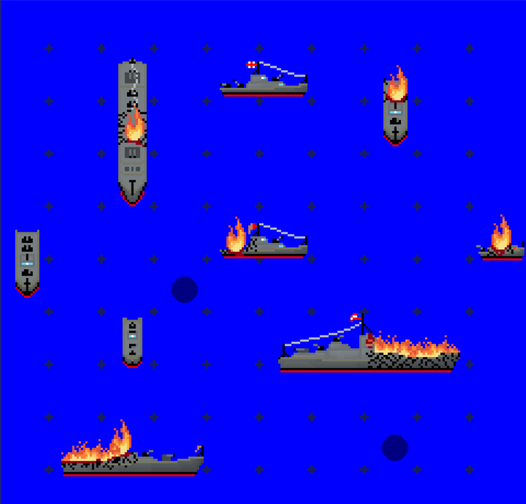

# BattleShips

## About
BattleShips is my first attempt to make an online game. It is a copy of the pen and pencil game called BattleShips, in Czech known as 'Lodě'. 
Currently it's work in progress.<br>
This is a picture of what the game looks like right now:


## Requirements
You need python version 3.9 or compatible and pygame installed.
For running the game you will need to be on the same local network as the server is, but internet access is not needed.
It should be possinble to have the server on a different network, but I haven't tested it yet.

## Running
You need to start exactly one server instance and then you can start as many clients as you wish.
```cmd
ServerMain.py
BattleShips.py
BattleShips.py
BattleShips.py
```

Once you start the server a message like this will pop up:
```cmd
INFO:root:server ready and listening at 192.168.0.159:1250
```
You will need to make sure that the SERVER_ADDRES constant above the Session class in [./Client/Session.py](./Client/Session.py) is the same as the server address reported in the message.

## Controls
#### LMB
Place a ship on the board or pick up a ship from the board.
#### RMB
Pick up a ship from the board. Note that this will override the ship you're currently holding.
#### Mouse wheel
Change size of the ship you're placing.
#### R
Change the orientation of the ship you're placing.
#### Q
Choose a ship which is the same size as the ship you are hovering over or free your cursor.
#### G
Change your state from waiting for opponnent to placing ships or vice versa.
Note that once you place all ships in your inventory you will be considered waiting for your opponent and you won't be able to move your ships around.
