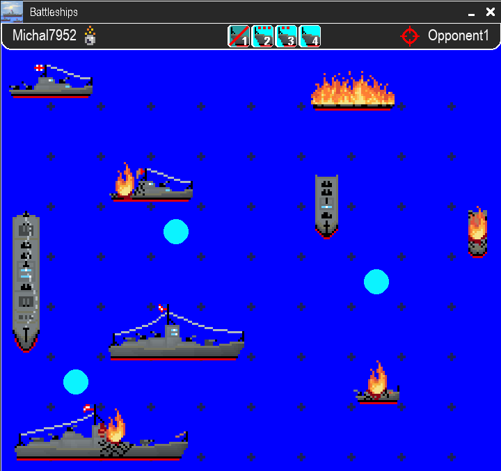

# BattleShips

BattleShips is an attempt to make an online multiplayer game.  
It is a copy of the pen and pencil game called BattleShips, in Czech known as *Lodě*. 
  


## Requirements
- python 3.9 or compatible
- pygame `pip install pygame`

## Running
You need to start exactly one server instance and then you can start as many clients as you wish.

- if on same LAN as the server - internet access is not needed.

```cmd
ServerMain.py
BattleShips.py
BattleShips.py
BattleShips.py
```
**If client is crashing after entering game** (blank screen) - connection error
- Check server address:
```cmd
INFO:root:server ready and listening at 192.168.0.159:1250
```
- make sure SERVER_ADDRES constant atop [./Client/Session.py](./Client/Session.py) is the same as the server address reported in the message.

## Controls
#### LMB
Place a ship on the board or pick up a ship from the board.
#### RMB
Pick up a ship from the board. Note that this will override the ship you're currently holding.
#### Mouse wheel
Change size of the ship you're placing.
#### R
Change the orientation of the ship you're placing.
#### Q
Choose a ship which is the same size as the ship you are hovering over or free your cursor.
#### G
Change your state from waiting for opponnent to placing ships or vice versa.
Note that once you place all ships in your inventory you will be considered waiting for your opponent and you won't be able to move your ships around.
